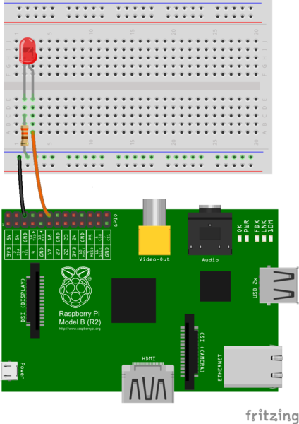

Generic LED usage instructions
==============================

Setting up the GPIO wiring
--------------------------
To make the RasPi talk to a LED via the GPIO interface 
(the spiky bit on top of the RasPi), you need to make a connection from 
the ground (GND) to one of the numbered GPIO pins.

Refer to the GPIO diagram in the section below to know which pin is which.

In the demo setup we expect positive pin of the the LED to be connected to 
GPIO 18, and the negative pin to be connected to the ground with a resistor 
(a 330 ohm one is recommended). See the image below (stolen from a more 
comprehensive tutorial) for an example setup.

GPIO pin reference
------------------

You can find more information about GPIO pin layouts on the Raspberry Pi at https://www.raspberrypi.org/documentation/usage/gpio/

More information
----------------
For a longer instrution, see https://thepihut.com/blogs/raspberry-pi-tutorials/27968772-turning-on-an-led-with-your-raspberry-pis-gpio-pins
